# Final DevOps Project — TaskBoard

**Name:** Arjun Aggarwal  **Roll No:** 24BCS10109

A complete end-to-end DevOps pipeline for **TaskBoard**, a small but realistic
task-management application, taking it from source code all the way to a monitored,
GitOps-managed Kubernetes deployment.

- **Repository:** https://github.com/arjunaggarwal-scaler/final-devops-project
- **Green CI/CD run:** https://github.com/arjunaggarwal-scaler/final-devops-project/actions/runs/37620619566
- **Container images:** `ghcr.io/arjunaggarwal-scaler/final-devops-project-backend` and `…-frontend` (public, tagged with the commit SHA)

---

## 1. Project overview

TaskBoard is a task board: a **FastAPI** backend exposing a REST API over a
**PostgreSQL** database (with Alembic migrations), and a **React + Vite** single-page
frontend served by **nginx**. The application is the vehicle; the point of the project
is the DevOps layer around it:

```
Application → Git → GitHub → CI pipeline → Build & Test → Security scanning →
Docker image → Container registry (GHCR) → Kubernetes → Helm → Monitoring → GitOps
```

Every stage in that chain is implemented and demonstrated in this repository.

## 2. Architecture diagram

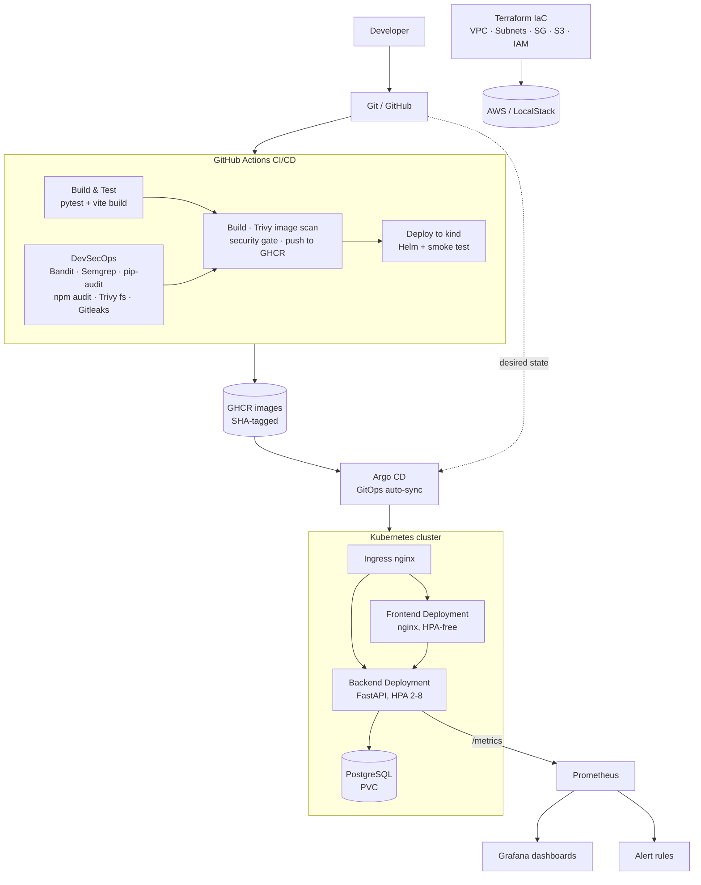
```mermaid
flowchart TB
    dev[Developer] --> git[Git / GitHub]
    git --> ci[GitHub Actions CI/CD]
    subgraph ci [GitHub Actions CI/CD]
        test[Build & Test<br/>pytest + vite build]
        sec[DevSecOps<br/>Bandit · Semgrep · pip-audit<br/>npm audit · Trivy fs · Gitleaks]
        bsp[Build · Trivy image scan<br/>security gate · push to GHCR]
        dep[Deploy to kind<br/>Helm + smoke test]
        test --> bsp
        sec --> bsp
        bsp --> dep
    end
    ci --> ghcr[(GHCR images<br/>SHA-tagged)]
    tf[Terraform IaC<br/>VPC · Subnets · SG · S3 · IAM] --> cloud[(AWS / LocalStack)]
    ghcr --> argocd[Argo CD<br/>GitOps auto-sync]
    git -.desired state.-> argocd
    argocd --> k8s

    subgraph k8s [Kubernetes cluster]
        ing[Ingress nginx]
        fe[Frontend Deployment<br/>nginx, HPA-free]
        be[Backend Deployment<br/>FastAPI, HPA 2-8]
        pg[(PostgreSQL<br/>PVC)]
        ing --> fe
        ing --> be
        fe --> be
        be --> pg
    end

    be -- /metrics --> prom[Prometheus]
    prom --> graf[Grafana dashboards]
    prom --> alerts[Alert rules]
```

## 3. Technologies used

| Layer | Technology |
|-------|-----------|
| Backend | FastAPI, SQLAlchemy, Alembic, Pydantic, Uvicorn |
| Frontend | React, Vite, nginx |
| Database | PostgreSQL 16 |
| Tests | Pytest (11 tests, isolated SQLite) |
| Containers | Docker, multi-stage builds, docker-compose |
| Registry | GitHub Container Registry (GHCR) |
| CI/CD | GitHub Actions |
| DevSecOps | Bandit (SAST), Semgrep (SAST), pip-audit + npm audit + Trivy fs (SCA), Gitleaks (secrets), Trivy image (image scan + gate) |
| IaC | Terraform (AWS provider, LocalStack-compatible) |
| Orchestration | Kubernetes (kind), Helm |
| Ingress / scaling | ingress-nginx, HorizontalPodAutoscaler, metrics-server |
| Monitoring | kube-prometheus-stack (Prometheus + Grafana), ServiceMonitor, PrometheusRule |
| GitOps | Argo CD |

## 4. Application setup

```
application/
├── backend/   FastAPI app, SQLAlchemy models, Alembic migration, pytest suite
└── frontend/  React + Vite SPA served by nginx
```

- REST API: `GET /api/tasks`, `GET /api/tasks/{id}`, `GET /api/tasks/stats`,
  `POST /api/tasks`, `PUT /api/tasks/{id}`, `DELETE /api/tasks/{id}`,
  plus `GET /health`, `GET /ready`, `GET /metrics`.
- The `tasks` table is created by the Alembic migration
  `application/backend/alembic/versions/0001_create_tasks.py`.

**Run the tests** (11 pass, against an isolated SQLite DB — never the production DB):

```bash
cd application/backend
pip install -r requirements.txt
pytest -v
```

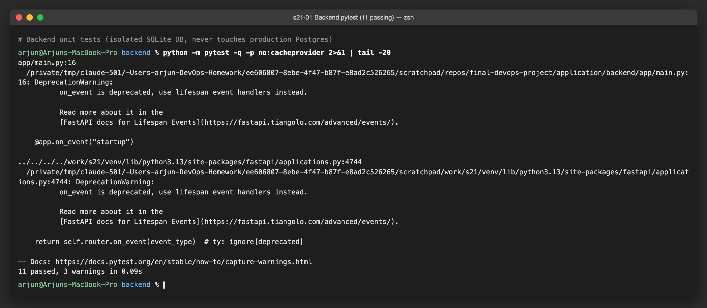

**Build the frontend:**

```bash
cd application/frontend
npm install && npm run build
```

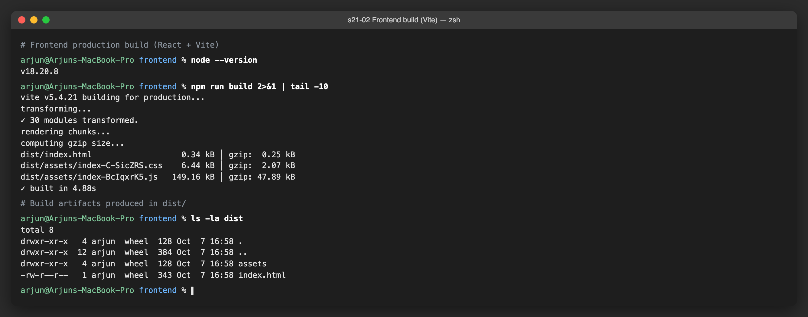

**What I understood:** the application is the foundation — a working, testable app with
health/readiness/metrics endpoints is what makes every later DevOps layer meaningful.

## 5. Docker setup

Both images are **multi-stage** and **run as non-root** (backend uid 10001, frontend
uid 101). See [`docker/README.md`](docker/README.md).

```bash
docker compose up --build
```

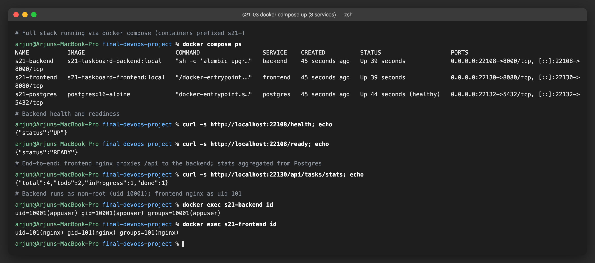

The running app in the browser (served by the frontend nginx, calling the backend API):

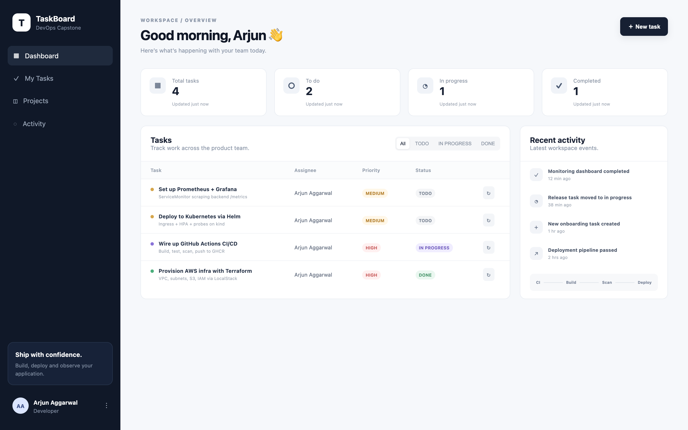
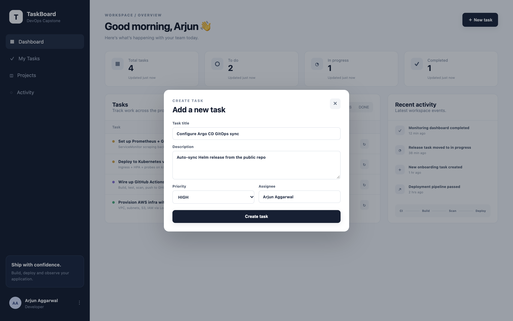

**What I understood:** multi-stage builds keep build tooling out of the runtime image,
and running as non-root is a baseline container-security practice the image scanner expects.

## 6. Kubernetes deployment

Plain manifests in [`kubernetes/`](kubernetes/) cover every required object:
Namespace, ConfigMap, Secret, PVC + Postgres, backend/frontend Deployments + Services,
Ingress, HPA, and **liveness / readiness / startup probes**.

Deployed on a **kind** cluster with **ingress-nginx** and **metrics-server**:

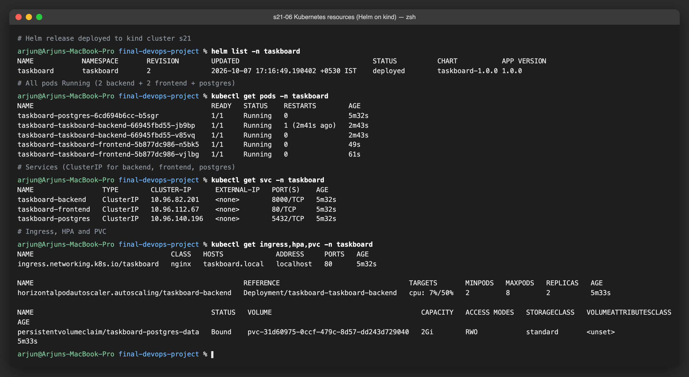

The app accessed through the **Ingress** (`taskboard.local`):

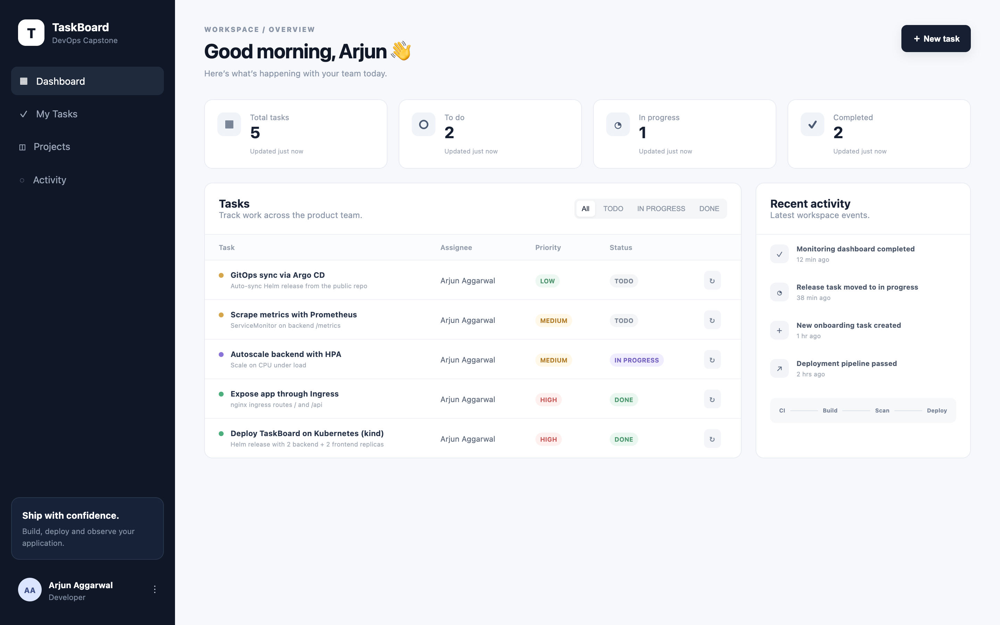

**HPA scaling under load** — the backend scaled from 2 to 8 replicas when CPU exceeded
the 50% target:

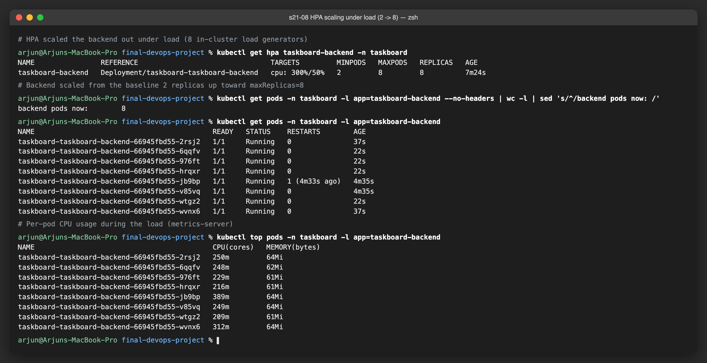

**What I understood:** the ConfigMap/Secret feed configuration into the Deployment,
probes gate traffic and restarts, the PVC gives Postgres durable storage, and the HPA
(driven by metrics-server) scales the backend horizontally under load.

## 7. Helm deployment

The chart in [`helm/taskboard/`](helm/taskboard/) renders the same stack with
`values.yaml` plus `values-dev.yaml` / `values-prod.yaml` overrides:

```bash
helm upgrade --install taskboard ./helm/taskboard -n taskboard --create-namespace
```

The `helm list` / `kubectl get` output in the screenshot above (§6) is the Helm release
in action (chart `taskboard-1.0.0`). Dev uses 1 replica + HPA off; prod uses 3 replicas
+ HPA on + ServiceMonitor on.

**What I understood:** Helm turns the raw manifests into a parameterised, versioned
release so the same chart serves dev and prod by swapping a values file.

## 8. Terraform infrastructure

[`terraform/`](terraform/) provisions a **VPC, two public + two private subnets, an
internet gateway + route table, a security group, an S3 bucket (versioned), and an IAM
role + policy**. Resources are prefixed `arjun-s21-`.

> **LocalStack note.** This machine has no AWS credentials, so Terraform runs against
> **LocalStack** (a local AWS emulator) with dummy `test/test` creds. The provider
> endpoints sit behind a `use_localstack` variable, so the **exact same code** targets
> real AWS by flipping `use_localstack = false`. ECR/EKS are not emulated by LocalStack
> Community, so an optional `enable_ecr` ECR block is included (off by default) and the
> EKS cluster would be added for real AWS; everything else is provisioned for real here.

```bash
terraform init && terraform plan && terraform apply
terraform output && terraform destroy
```

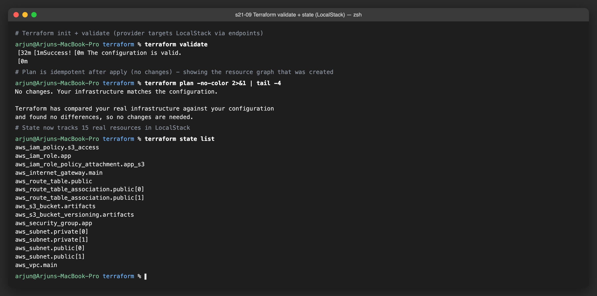
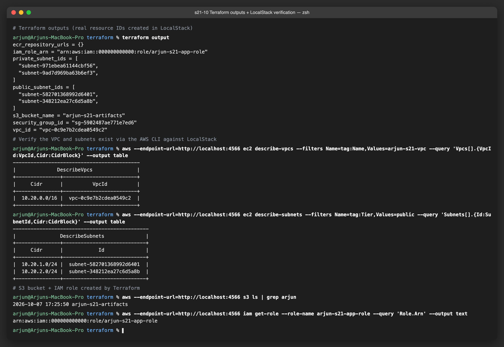
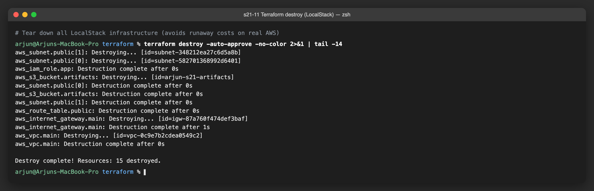

**What I understood:** IaC makes infrastructure reproducible and reviewable; keeping the
provider endpoints behind a variable means the same HCL is portable between LocalStack
and real AWS without edits.

## 9. CI/CD pipeline

[`.github/workflows/ci-cd.yml`](.github/workflows/ci-cd.yml) runs on every push to
`main` with four jobs:

1. **Build & Test** — `pytest` (fails the build on test failure) + frontend `vite build`.
2. **DevSecOps** — SAST, SCA and secret scanning (see §10).
3. **Build, Scan & Push** — build both images, Trivy **image scan as a security gate**
   (fails on HIGH/CRITICAL), then push to **GHCR tagged with the commit SHA** (and `latest`).
4. **Deploy to Kubernetes** — spin up a throwaway kind cluster, `helm upgrade --install`,
   and smoke-test the rollout.

The pipeline is **green** end to end:

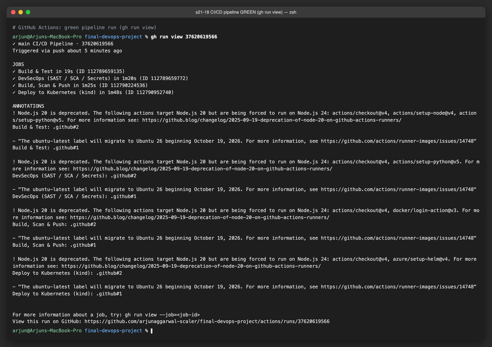
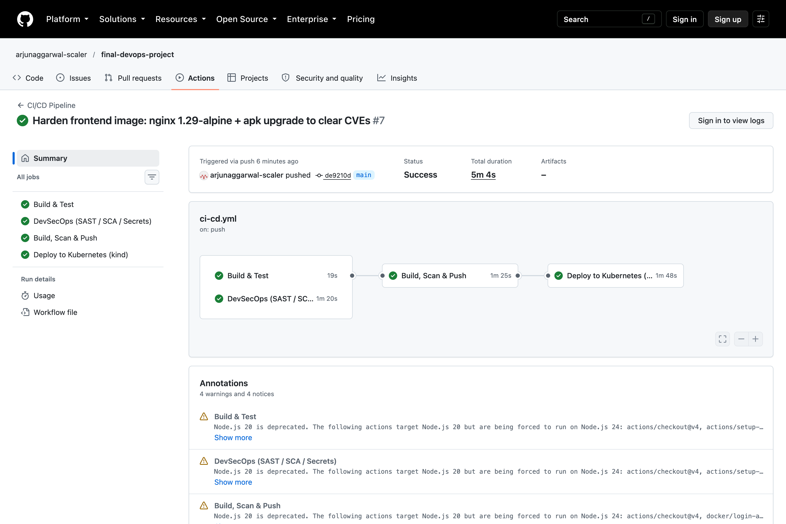

Images published to GHCR with SHA + `latest` tags:

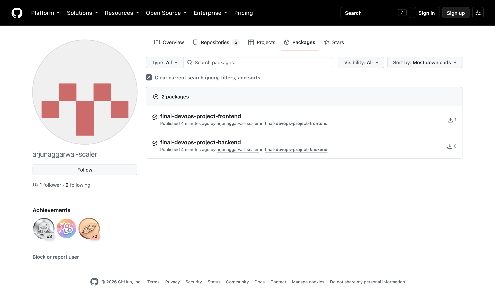

**What I understood:** the pipeline is the automation backbone — tests and security gates
run before anything is published, and only SHA-pinned, scanned images reach the registry
and the cluster.

## 10. DevSecOps implementation

Security runs as a dedicated job **before** any image is built, plus a gate on the images:

| Category | Tool | Config |
|----------|------|--------|
| SAST | Bandit | [`security/bandit.yaml`](security/bandit.yaml) |
| SAST | Semgrep | [`security/semgrep.yaml`](security/semgrep.yaml) |
| SCA | pip-audit, npm audit, Trivy fs | — |
| Secret scanning | Gitleaks | [`security/gitleaks.toml`](security/gitleaks.toml) |
| Image scan (gate) | Trivy image | fails on HIGH/CRITICAL |

The image gate did its job: early runs failed on HIGH CVEs in pip's vendored `msgpack`,
`setuptools`, Starlette, and the nginx base image's OpenSSL. These were **remediated** by
stripping pip/setuptools from the backend image, upgrading FastAPI/Starlette, and moving
the frontend to `nginx-unprivileged:1.29-alpine` with `apk upgrade` — after which the gate
passes cleanly.

**What I understood:** a security gate is only useful if it actually blocks the build; the
value came from reading each CVE and fixing the real dependency, not from disabling the check.

## 11. Monitoring

[`monitoring/`](monitoring/) installs a lean **kube-prometheus-stack** (Prometheus +
Grafana). The backend exposes Prometheus metrics at `/metrics`; a **ServiceMonitor**
(in the Helm chart) tells Prometheus to scrape every backend pod, a **PrometheusRule**
([`monitoring/alert-rule.yaml`](monitoring/alert-rule.yaml)) defines two alerts, and a
**Grafana dashboard** ([`monitoring/grafana-dashboard.json`](monitoring/grafana-dashboard.json))
visualises request rate, status codes, p95 latency and total requests.

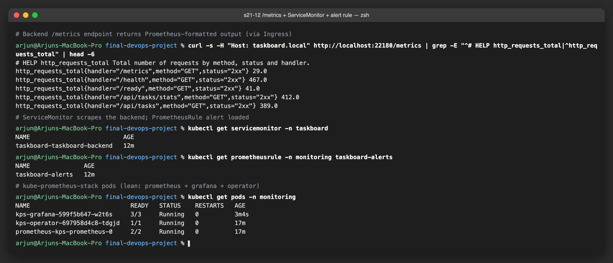
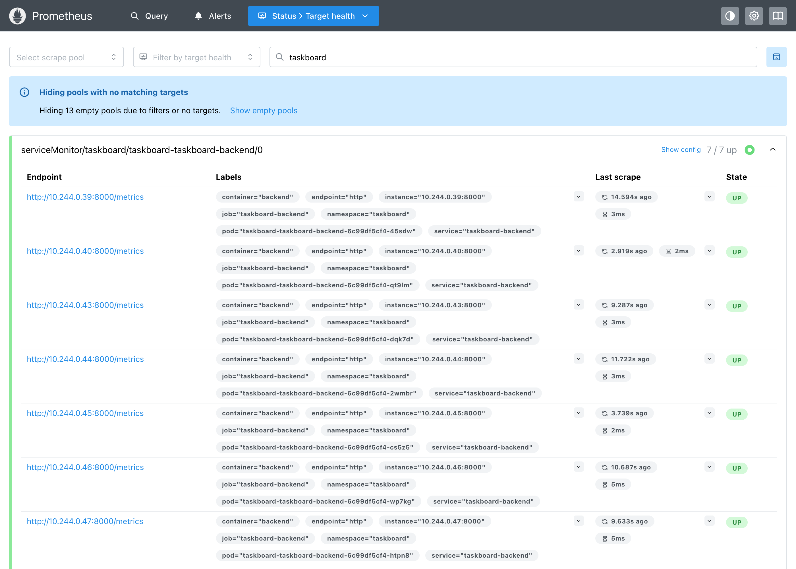
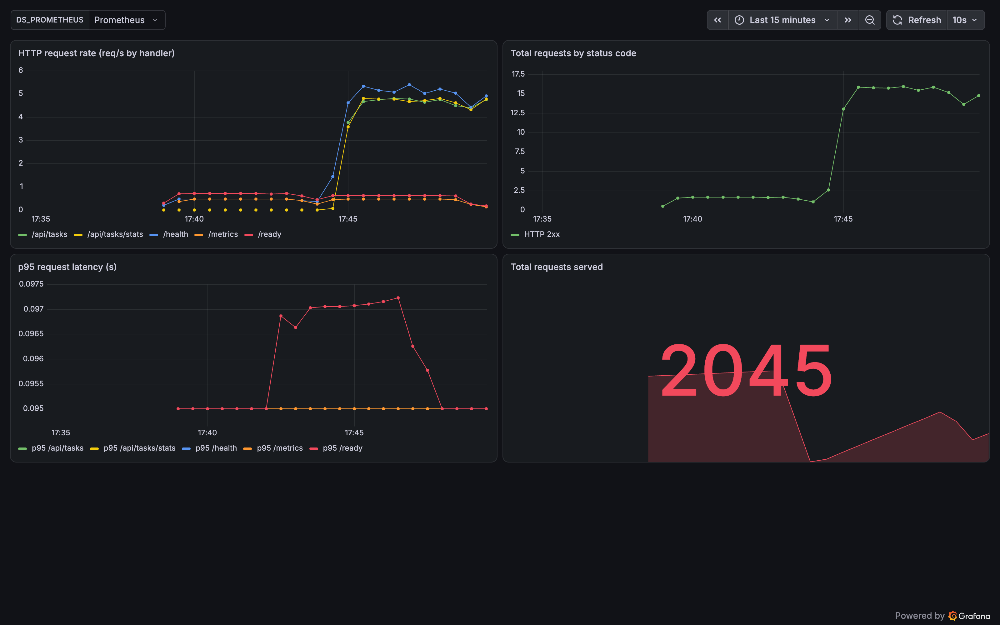
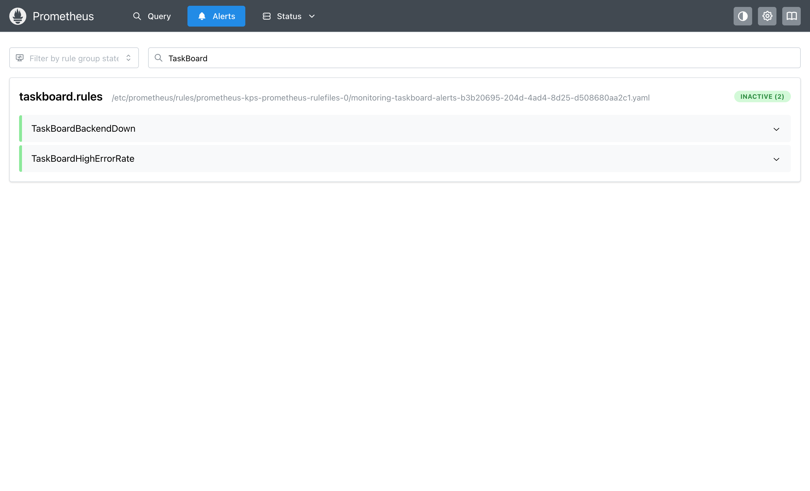

**What I understood:** ServiceMonitors make scraping declarative, Prometheus stores the
time series, Grafana turns them into dashboards, and alert rules turn them into actionable
signals — the backbone of observability.

## 12. GitOps

[`gitops/application.yaml`](gitops/application.yaml) is an **Argo CD Application** that
tracks the Helm chart in this public repo with `automated` sync (`prune` + `selfHeal`).
Argo CD reports the app **Synced + Healthy**:

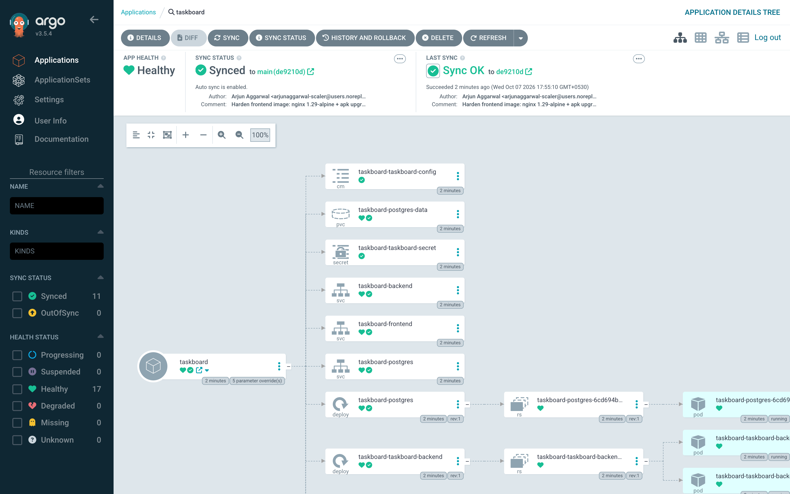

**Auto-sync after a Git commit:** pushing a commit that scales the frontend to 3 replicas
caused Argo CD to reconcile the cluster automatically (revision `de9210d` → `4cc02c1`),
with no `kubectl`/`helm` command:

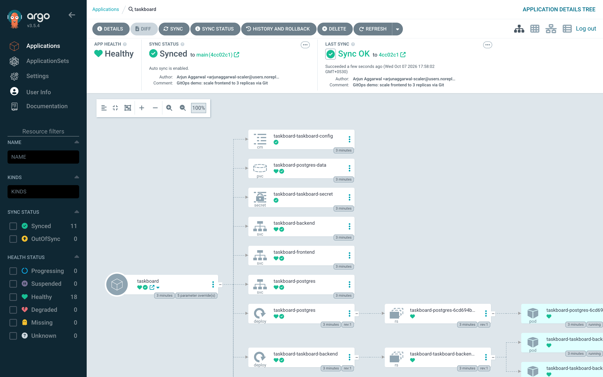

**What I understood:** GitOps makes Git the single source of truth — you change the
desired state in a commit and the controller converges the cluster to match, which also
means drift is detected and healed automatically.

## 13. Troubleshooting

Five faults were intentionally introduced into the running cluster, then diagnosed, root-
caused, fixed and verified. Full write-up with before/after screenshots:
[`troubleshooting/README.md`](troubleshooting/README.md).

| # | Fault | Symptom | Root cause | Fix |
|---|-------|---------|-----------|-----|
| 1 | Wrong image tag | `ImagePullBackOff` | tag not in GHCR | restore correct tag |
| 2 | Service selector mismatch | empty Endpoints, `/api` down | selector ≠ pod labels | restore selector |
| 3 | Bad Secret | backend `CrashLoopBackOff` | wrong DB password in `DATABASE_URL` | restore secret + restart |
| 4 | Failing readiness path | pod stuck `0/1`, rollout stalls | probe path 404 | restore `/ready` |
| 5 | Oversized CPU request | pod `Pending` | request > node allocatable | restore `100m`/`500m` |

**What I understood:** `kubectl describe` Events and container logs resolve the vast
majority of Kubernetes faults; the discipline is identify → investigate → root cause →
fix → verify, and document.

## 14. Screenshots

All screenshots referenced above live in [`screenshots/`](screenshots/) and were captured
from real executions on this machine (terminal), real headless-Chrome renders of the live
UIs (app, Grafana, Prometheus, Argo CD), and real GitHub Actions / GHCR pages.

## Lessons learned

- A green pipeline is earned, not assumed — most of the effort went into making the
  **security gate** pass by genuinely remediating CVEs (image hardening, dependency bumps).
- **Registry/rate-limit reality:** container-image-based CI steps are fragile on shared
  IPs; installing the Trivy binary from apt and using GHCR for Gitleaks made the pipeline
  deterministic.
- **One image, two environments:** templating the frontend's nginx upstream with
  `BACKEND_HOST` let the same image serve both Docker Compose and Kubernetes.
- **Probes, HPA and resource requests** are the levers that make a deployment behave well
  (or badly) under real conditions — the troubleshooting exercise drove that home.
- **GitOps closes the loop:** once Argo CD owns the deployment, the cluster follows Git,
  and operations become code review.

## Cleanup

```bash
# App / cluster
helm uninstall taskboard -n taskboard
kind delete cluster --name s21
# Infrastructure
cd terraform && terraform destroy -auto-approve
# Local containers
docker compose down -v
```

---

## Project structure

```
final-devops-project/
├── application/        FastAPI backend + React/Vite frontend (+ Dockerfiles, tests)
├── docker/             Docker documentation
├── docker-compose.yml  Local full-stack definition
├── kubernetes/         Plain manifests (Deployment, Service, ConfigMap, Secret, Ingress, HPA, probes, PVC)
├── helm/taskboard/     Helm chart (values.yaml + dev/prod overrides + templates)
├── terraform/          IaC: VPC, subnets, SG, S3, IAM (LocalStack/AWS-compatible)
├── .github/workflows/  GitHub Actions CI/CD pipeline
├── security/           Bandit, Semgrep, Gitleaks configs (DevSecOps)
├── monitoring/         kube-prometheus-stack values, Grafana dashboard, alert rule
├── gitops/             Argo CD Application
├── troubleshooting/    Troubleshooting challenge write-up
└── README.md
```
